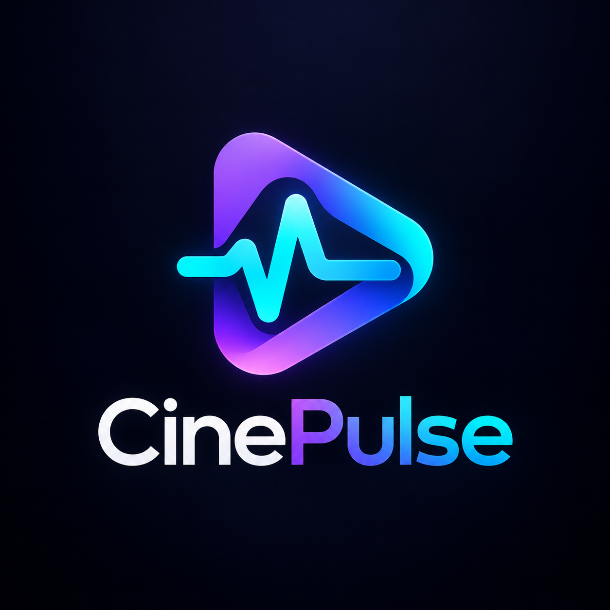

# CinePulse 🎬⚡

> **Assista. Avalie. Conecte.**
> O pulso da sua experiência com filmes e séries.




[](https://flutter.dev)
[](https://dart.dev)


## 📌 Sobre o Projeto

O **CinePulse** é um aplicativo Flutter para descobrir filmes e séries, salvar o que se deseja assistir e registrar a experiência pessoal. O catálogo e as imagens vêm do **TMDB**; autenticação e dados do usuário usam **Firebase Authentication** e **Cloud Firestore**. A entrega CP6 inclui APK Android e testes automatizados.

O produto responde à fragmentação entre busca de títulos, lista de interesse e registro de avaliações. O foco atual é a jornada individual: descobrir → guardar → assistir e avaliar → consultar Diário e Perfil. A motivação, as hipóteses e os próximos passos estão em [Propósito](PROPOSITO.md).

### Por que Flutter?

- **Uma base de interface:** permite compartilhar componentes e regras entre telas sem duplicar implementação.
- **Iteração rápida:** hot reload e testes de widgets ajudam a revisar fluxos e estados de tela.
- **Controle visual:** facilita manter o tema escuro, a marca e os componentes consistentes em diferentes larguras.
- **Entrega Android:** a estrutura nativa do repositório gera APKs com o mesmo código Dart. O projeto CP6 foi validado para Android; não há promessa de builds iOS, web ou desktop nesta entrega.

## 🚀 Diferenciais

| Recurso | Estado no CP6 |
|---|---|
| **PulseScore pessoal** | Quatro critérios opcionais — história, atuação, visual e trilha — com média somente dos valores preenchidos. Não representa nota da comunidade. |
| **MoodTags** | Tags opcionais na avaliação e filtros de descoberta por mapeamento determinístico para gêneros TMDB. Não são recomendações por IA. |
| **Spoiler Safe** | Review pessoal marcada com spoiler inicia oculta e pode ser revelada por card. |
| **PulseMatch** | Fórmula determinística implementada e testada; ainda não há comparação entre usuários na interface. |

## 🛠️ Tecnologias e arquitetura

- **Flutter 3.35+ / Dart 3.9+:** interface Material 3 com tema escuro e organização **Feature-First**.
- **Firebase Authentication:** cadastro, login, logout e restauração de sessão por e-mail/senha.
- **Cloud Firestore:** perfil e subcoleções pessoais `watchlist` e `ratings`, protegidas por regras baseadas no `uid`.
- **TMDB API:** tendências, busca, filtros Discover e detalhes de filmes e séries via Bearer token.
- **`http`, `flutter_svg`:** acesso HTTP e exibição da marca TMDB no app.
- **`flutter_test`:** testes com fakes/repositórios simulados, sem chamadas aos serviços reais.

## 💻 Estrutura do repositório

```text
android/                 Projeto Android, ícone e splash
assets/brand/            Logo oficial, símbolos e atribuição TMDB
config/                  Exemplo de configuração local TMDB
docs/                    Dossiê, requisitos, UX e material histórico
lib/core/                Tema e componentes compartilhados
lib/features/auth/       Autenticação e AuthGate
lib/features/catalog/    TMDB, modelos, busca, detalhe e avaliações
lib/features/home/       Home e AppShell
lib/features/diary/      Diário pessoal
lib/features/lists/      Watchlist
lib/features/profile/    Perfil e cálculo puro de PulseMatch
test/                    Testes de modelo, regras e widgets
firestore.rules          Regras de acesso aos dados por usuário
SETUP.md                 Configuração local detalhada
PROPOSITO.md             Visão de produto e roadmap
```

## ⚙️ Instalação e configuração

**Pré-requisitos:** Git, Flutter 3.35+ (Dart 3.9+), Android SDK e um emulador ou dispositivo Android. Confira o ambiente com `flutter doctor`.

1. Clone o repositório e instale as dependências:

   ```powershell
   git clone https://github.com/matheeusvx/CinePulse.git
   cd CinePulse
   flutter pub get
   ```

2. No Firebase Console, habilite **Authentication > Email/Password** e crie o **Cloud Firestore**. Registre o Android com package name `com.cinepulse.cinepulse`. Execute `flutterfire configure --platforms=android` para gerar localmente `lib/firebase_options.dart` e `android/app/google-services.json`. Publique manualmente as regras de [firestore.rules](firestore.rules).
3. Obtenha um **API Read Access Token** do TMDB. Copie `config/local.example.json` para `config/local.json` e defina `TMDB_READ_ACCESS_TOKEN`. Os três arquivos de configuração local estão ignorados pelo Git. Não versione credenciais. O token passado por `--dart-define-from-file` fica embutido no APK; distribuição pública exige outra estratégia de proteção, como um proxy.

O procedimento detalhado está em [SETUP.md](SETUP.md). Não é preciso recriar o projeto Flutter ou a pasta Android.

## ▶️ Como rodar e gerar APK

```powershell
flutter run --dart-define-from-file=config/local.json
flutter build apk --debug --dart-define-from-file=config/local.json
flutter build apk --release --dart-define-from-file=config/local.json
```

Os APKs são gerados em `build/app/outputs/flutter-apk/`. A configuração atual usa **assinatura de debug também no build release**: o APK é adequado para entrega acadêmica e testes, não para publicação na Play Store.

## ✅ Funcionalidades implementadas

- Home com títulos em alta do TMDB, MoodTags por gênero e estados de carregamento, erro e vazio.
- Busca por filmes e séries, detalhe com informações do TMDB e fallback para imagens ausentes.
- Watchlist pessoal persistida no Firestore; marcar um título como assistido o remove da Watchlist.
- Avaliação geral de 0,5 a 5, MoodTags opcionais, PulseScore opcional e review opcional de até 2.000 caracteres.
- Spoiler Safe nas reviews pessoais exibidas no detalhe, na Home e no Perfil.
- Diário com registros reais, agrupamento por mês, métricas, edição e exclusão.
- Perfil com dados e métricas pessoais reais, reviews recentes e saída da conta.
- Login, cadastro, logout e sessão persistente com Firebase Authentication.

Não há feed social, seguidores, IA/ML, listas personalizadas ou PulseMatch entre usuários na interface.

## 📈 Evolução CP4 → CP5 → CP6

| Etapa | Entrega |
|---|---|
| **CP4** | Ideação, arquitetura inicial, identidade escura e protótipo visual de Home, Diário, Listas e Perfil. |
| **CP5** | Estrutura Android, Firebase Auth/Firestore, TMDB, busca, detalhe, Watchlist e avaliação persistente. |
| **CP6** | Diário e Perfil com dados reais; reviews, MoodTags, Spoiler Safe e PulseScore pessoal; remoção de dados fictícios; logo oficial, ícone, splash, testes e APK. |

## 🧪 Testes e qualidade

```powershell
flutter pub get
dart format lib test
flutter analyze
flutter test
```

Na validação CP6, **27 testes passaram** e `flutter analyze` não apontou problemas. Os testes automatizados usam fakes e não acessam Firebase/TMDB reais; a integração com um projeto configurado requer validação manual. [SETUP.md](SETUP.md) registra os comandos de build.

## 👥 Equipe e responsabilidades

Os papéis abaixo documentam a divisão acadêmica de trabalho, conforme [docs/07-divisao-da-equipe.md](docs/07-divisao-da-equipe.md); não atribuem individualmente cada mudança posterior do CP6.

| Integrante | Frente principal |
|---|---|
| **Matheus Morelli** | Liderança técnica, arquitetura e integração Flutter. |
| **Cauã Ferreira Muniz** | Marca, UI e identidade visual. |
| **Rafael Ferreira** | Produto, pesquisa de UX, personas e requisitos. |
| **Victor Nicolas** | Desenvolvimento Flutter, navegação e telas. |
| **Henrique Nicolas** | Documentação, pitch e QA. |

## 🎨 Identidade visual

A identidade oficial usa a [nova logo CinePulse](assets/brand/cinepulse_logo_oficial.png), fundo *dark navy* e acentos violeta e ciano. O símbolo isolado compõe o ícone Android; a marca completa aparece no splash e neste README. O tema e os componentes estão em `lib/core/`. O [guia visual histórico](docs/04-identidade-visual.md) registra a evolução da proposta; algumas imagens antigas em `docs/` representam protótipos CP4, não telas atuais.

## 📚 Documentação complementar

- [Propósito, decisões e roadmap](PROPOSITO.md)
- [Configuração local](SETUP.md) e [contribuição](CONTRIBUTING.md)
- [Visão de produto](docs/01-visao-produto.md), [personas e jornada](docs/02-publico-personas-e-jornada.md), [MVP e requisitos](docs/03-mvp-e-requisitos.md)
- [Divisão da equipe](docs/07-divisao-da-equipe.md) e [roadmap histórico CP5/CP6](docs/09-roadmap-cp5-cp6.md)

O material histórico documenta hipóteses e protótipos; sua descrição de funcionalidades futuras não deve ser interpretada como estado atual do app.

### Atribuição do catálogo


**This product uses the TMDB API but is not endorsed or certified by TMDB.** Dados e imagens de catálogo vêm do [TMDB](https://www.themoviedb.org). A marca e a atribuição seguem a [orientação oficial](https://developer.themoviedb.org/docs/faq).

## 📄 Licença e uso acadêmico

Projeto desenvolvido para fins acadêmicos na FIAP. **Não há arquivo de licença de software no repositório**; a indicação de uso acadêmico não concede, por si só, permissão de redistribuição. Marcas e conteúdos de terceiros seguem seus respectivos termos, incluindo os do TMDB.
