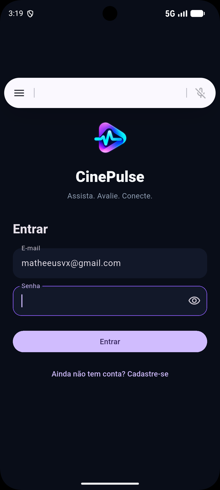
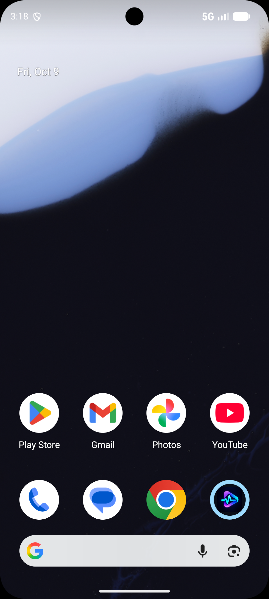
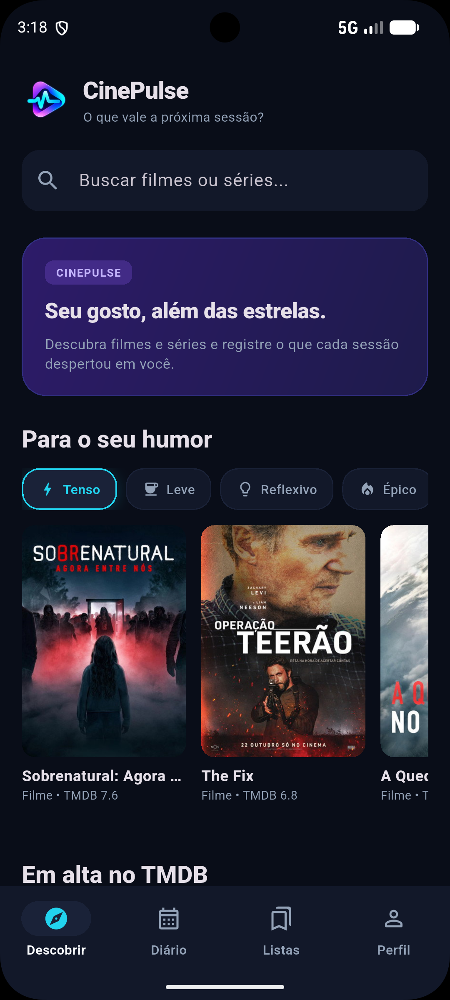
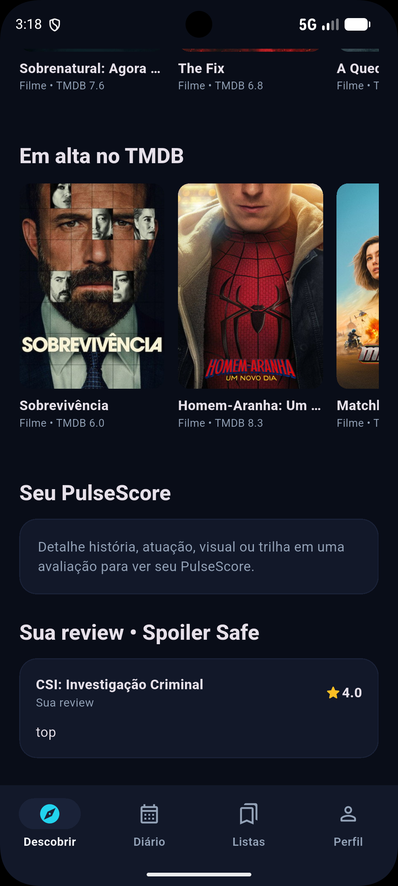
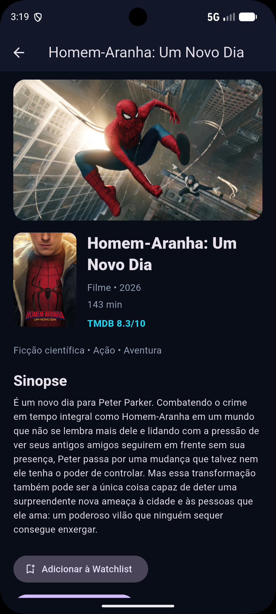
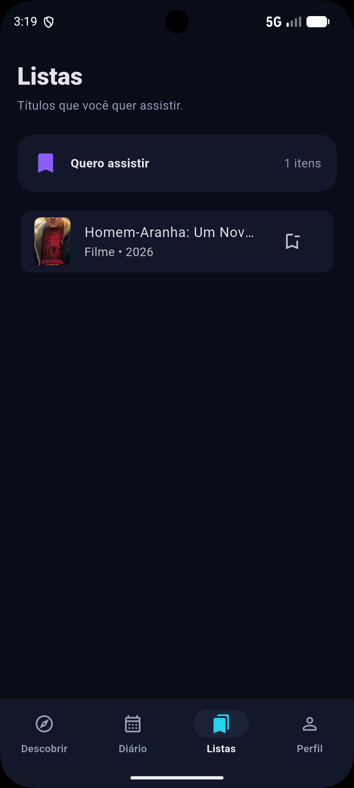
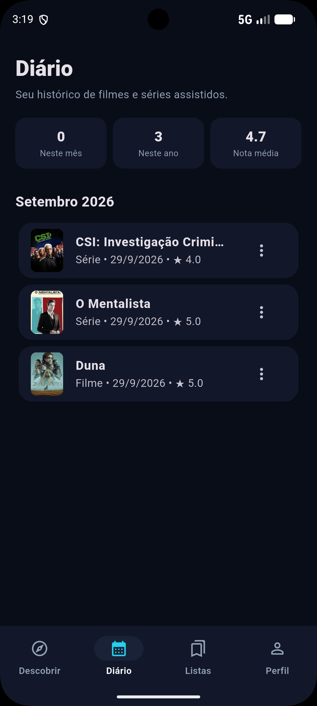
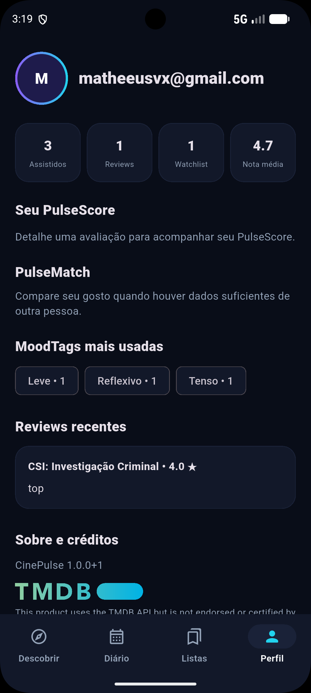

# CinePulse 🎬⚡

> **Assista. Avalie. Conecte.**
> O pulso da sua experiência com filmes e séries.


[](https://flutter.dev)
[](https://dart.dev)


## 📌 Sobre o Projeto

O **CinePulse** é um aplicativo Flutter para descobrir filmes e séries, consultar dados reais do TMDB, manter uma Watchlist e registrar o que foi assistido. Avaliações podem incluir MoodTags, review, proteção de spoiler e PulseScore pessoal. O Diário organiza o histórico; o Perfil mostra dados e métricas reais da conta. **Firebase Authentication** autentica usuários e **Cloud Firestore** persiste os dados pessoais.

A jornada central é **descobrir → guardar → assistir e avaliar → consultar Diário e Perfil**. A motivação e o roadmap estão em [Propósito](PROPOSITO.md).

## 🎥 Demonstração do Produto

[](https://youtu.be/TcCSXo9Qshw)

> Vídeo da versão final do CinePulse: autenticação, descoberta de títulos pelo TMDB, Watchlist, avaliações, Diário e Perfil.

[▶️ Assistir demonstração no YouTube](https://youtu.be/TcCSXo9Qshw)

## 📱 Aplicativo em funcionamento

Capturas reais da versão final do aplicativo Android. Títulos e dados pessoais exibidos refletem uma sessão de demonstração.

### Autenticação e identidade

| Login | Ícone Android |
|:---:|:---:|
|  |  |

### Descoberta

| Home | Tendências e seção pessoal |
|:---:|:---:|
|  |  |

### Catálogo e organização

| Detalhe do título | Watchlist |
|:---:|:---:|
|  |  |

### Histórico e perfil

| Diário | Perfil |
|:---:|:---:|
|  |  |

## 📱 Justificativa da escolha do Flutter

O Flutter permite compartilhar componentes e lógica de interface, iterar com hot reload e testar widgets sem acessar serviços reais. Seu controle de renderização ajuda a manter o tema escuro consistente. Nesta entrega, a estrutura nativa Android gera APKs; builds iOS, web e desktop não fazem parte da validação CP6.

## 🚀 Diferenciais

| Funcionalidade | Descrição |
|---|---|
| **PulseScore** | Pontuação pessoal opcional de história, atuação, visual e trilha, calculada somente com critérios preenchidos. |
| **MoodTags** | Tags opcionais na avaliação e filtros determinísticos do catálogo por gêneros TMDB. |
| **Spoiler Safe** | Reviews pessoais com spoiler iniciam ocultas e podem ser reveladas individualmente. |
| **PulseMatch** | Algoritmo determinístico implementado e testado; comparação entre usuários ainda não disponível na interface. |

## 🛠️ Tecnologias Utilizadas

- **Flutter e Dart:** aplicativo Android e lógica de interface.
- **Material Design 3:** componentes adaptados ao tema escuro CinePulse.
- **Firebase Authentication:** cadastro, login, logout e restauração de sessão por e-mail/senha.
- **Cloud Firestore:** perfil, Watchlist e avaliações isolados por usuário.
- **TMDB API e `http`:** tendências, busca, filtros Discover e detalhes de filmes e séries.
- **`flutter_svg`:** exibição da marca oficial TMDB no app.
- **`flutter_test`:** testes de modelo, cálculo e widgets com fakes.
- **`flutter_launcher_icons` e `flutter_native_splash`:** geração do ícone e splash Android.

## 🧱 Arquitetura e Estrutura

A arquitetura **Feature-First** mantém cada fluxo em `lib/features/` e os componentes compartilhados em `lib/core/`. Repositórios separam a interface do acesso ao TMDB e ao Firestore.

```text
assets/brand/            Identidade oficial e atribuição TMDB
android/                 Projeto e recursos nativos Android
config/                  Exemplo de configuração TMDB
docs/                    Dossiê e capturas reais em screenshots/
lib/core/                Tema e componentes compartilhados
lib/features/auth/       Autenticação e AuthGate
lib/features/catalog/    TMDB, busca, detalhe e avaliações
lib/features/home/       Home e AppShell
lib/features/diary/      Diário pessoal
lib/features/lists/      Watchlist
lib/features/profile/    Perfil e cálculo puro de PulseMatch
test/                    Testes automatizados
firestore.rules          Regras de acesso por usuário
SETUP.md                 Configuração local detalhada
PROPOSITO.md             Visão e roadmap
```

## ✅ Funcionalidades Implementadas

- **Conta:** cadastro, login, logout e persistência de sessão.
- **Descoberta:** tendências do TMDB, busca por filmes e séries, filtros MoodTags e detalhes.
- **Organização:** Watchlist persistente; marcar como assistido remove o título da lista.
- **Avaliação:** nota geral de 0,5 a 5, MoodTags, review opcional com Spoiler Safe e PulseScore pessoal opcional.
- **Histórico:** Diário por mês, métricas pessoais, edição e exclusão de avaliações.
- **Perfil:** dados e estatísticas reais da conta, MoodTags frequentes e reviews recentes.
- **Experiência e entrega:** estados de carregamento, erro e vazio; ícone e splash; APK Android.

## 📈 Evolução CP4 → CP5 → CP6

| Etapa | Entrega |
|---|---|
| **CP4** | Ideação, pesquisa de UX, identidade visual, arquitetura e protótipo das telas principais. |
| **CP5** | Android, Firebase, TMDB, autenticação, busca, detalhe, Watchlist e persistência. |
| **CP6** | Diário e Perfil reais; MoodTags, reviews, Spoiler Safe, PulseScore pessoal e núcleo determinístico de PulseMatch; marca oficial, ícone, splash, testes, APK e documentação final. |

## 🧪 Testes e Qualidade

Na validação CP6, **27 testes automatizados passaram** e `flutter analyze` não apontou problemas. Os testes usam fakes e não acessam Firebase ou TMDB reais; a integração com o projeto configurado requer validação manual.

```powershell
flutter pub get
flutter analyze
flutter test
```

## ⚙️ Instalação e Configuração

**Pré-requisitos:** Git, Flutter 3.35+ (Dart 3.9+), Android SDK e um emulador ou dispositivo Android. Confira o ambiente com `flutter doctor`.

```powershell
git clone https://github.com/matheeusvx/CinePulse.git
cd CinePulse
flutter pub get
```

1. No Firebase Console, habilite **Authentication > Email/Password** e crie o **Cloud Firestore**. Registre o Android como `com.cinepulse.cinepulse`. Execute `flutterfire configure --platforms=android` para gerar localmente `lib/firebase_options.dart` e `android/app/google-services.json`. Publique manualmente [firestore.rules](firestore.rules).
2. Obtenha o **API Read Access Token** do TMDB. Copie `config/local.example.json` para `config/local.json` e preencha:

   ```json
   {
     "TMDB_READ_ACCESS_TOKEN": "SEU_TOKEN"
   }
   ```

Esses três arquivos locais estão no `.gitignore` e **não devem ser versionados**. O token passado por `--dart-define-from-file` fica embutido no APK; distribuição pública exige outra estratégia de proteção, como um proxy. O passo a passo completo está em [SETUP.md](SETUP.md).

## ▶️ Como Rodar e Gerar APK

```powershell
flutter run --dart-define-from-file=config/local.json
flutter build apk --debug --dart-define-from-file=config/local.json
flutter build apk --release --dart-define-from-file=config/local.json
```

Os APKs ficam em `build/app/outputs/flutter-apk/`. O release atual usa assinatura de debug: serve para entrega acadêmica e teste, não para publicação na Play Store.

## 👥 Equipe e Responsabilidades

Papéis documentados em [docs/07-divisao-da-equipe.md](docs/07-divisao-da-equipe.md); não atribuem individualmente todas as mudanças posteriores do CP6.

| Integrante | Responsabilidade principal |
|---|---|
| **Matheus Morelli** | Liderança técnica, arquitetura e integração Flutter. |
| **Cauã Ferreira Muniz** | Marca, UI e identidade visual. |
| **Rafael Ferreira** | Produto, pesquisa de UX, personas e requisitos. |
| **Victor Nicolas** | Desenvolvimento Flutter, navegação e telas. |
| **Henrique Nicolas** | Documentação, pitch e QA. |

## 🎨 Identidade Visual

A [logo oficial do CinePulse](assets/brand/cinepulse_logo_oficial.png) combina *Dark Navy*, violeta e ciano. O símbolo isolado é usado como ícone Android, visto na [captura do dispositivo](docs/screenshots/icone-android.png). O tema e os componentes estão em `lib/core/`. O [guia visual histórico](docs/04-identidade-visual.md) documenta a evolução da marca.

## 📚 Documentação Complementar

- [Propósito, decisões e roadmap](PROPOSITO.md)
- [Configuração local](SETUP.md) e [contribuição](CONTRIBUTING.md)
- [Visão de produto](docs/01-visao-produto.md), [personas e jornada](docs/02-publico-personas-e-jornada.md), [MVP e requisitos](docs/03-mvp-e-requisitos.md)
- [Divisão da equipe](docs/07-divisao-da-equipe.md) e [roadmap histórico CP5/CP6](docs/09-roadmap-cp5-cp6.md)

Os documentos históricos podem descrever hipóteses e protótipos que não estão no aplicativo atual.

### Atribuição do catálogo


**This product uses the TMDB API but is not endorsed or certified by TMDB.** Dados e imagens de catálogo vêm do [TMDB](https://www.themoviedb.org).

## Limitações atuais

Não há feed social, seguidores, IA/ML ou PulseMatch entre contas na interface. O APK release ainda não está configurado para publicação na Play Store.

## 📄 Licença e Uso Acadêmico

Projeto desenvolvido para fins acadêmicos na FIAP. Não há arquivo de licença de software no repositório; a indicação de uso acadêmico não concede, por si só, permissão de redistribuição. Marcas e conteúdos de terceiros seguem seus respectivos termos.
