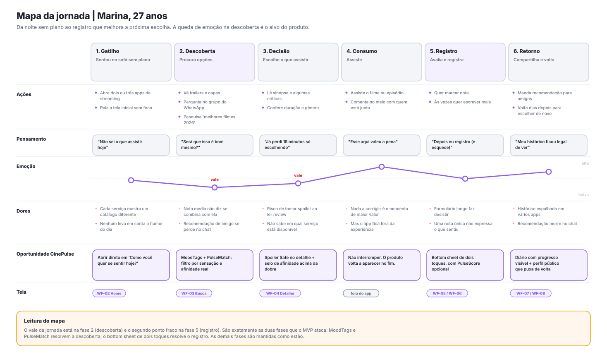

# 02 — Público, Personas e Jornada

> **Responsável:** Rafael Ferreira (Product / UX) · **Checkpoint 4** · Atualizado em 09/09/2026
> Documentos irmãos: [01 — Visão do produto](01-visao-produto.md) · [03 — MVP e requisitos](03-mvp-e-requisitos.md) · [06 — Wireframes e fluxos](06-wireframes-e-fluxos.md) · [10 — Pesquisa e validação](10-pesquisa-e-validacao.md)

---

## 1. Como o público foi recortado

Idade e renda descrevem quem a pessoa é, mas não explicam por que ela usaria o app. O recorte do CinePulse é **comportamental**, com a demografia funcionando apenas como moldura.

### Critérios que definem o público-alvo

| Critério | Faixa que nos interessa |
|---|---|
| **Frequência de consumo** | Assiste **pelo menos 2 títulos por semana** (filme ou episódio) |
| **Acesso** | Assina ou tem acesso a **1 ou mais serviços de streaming** |
| **Comportamento social** | Comenta, recomenda ou pede recomendação sobre o que assiste |
| **Relação com registro** | Já tentou registrar o que assiste (lista no Notes, print, planilha, outro app) — e abandonou |
| **Dispositivo** | Usa o celular como tela principal para descobrir o que assistir |

> A quarta linha é a mais importante: **a tentativa frustrada de registrar** é o sinal mais forte de que a pessoa sente a dor. Ela é a pergunta de qualificação nº 1 da pesquisa (doc 10).

### Segmentos

| Segmento | Descrição | Tamanho relativo | Prioridade no MVP |
|---|---|---|---|
| **Primário** | 18–30 anos, heavy user de streaming, ativo em redes sociais, consome filmes **e** séries | Maior | **Foco total** |
| **Secundário** | Cinéfilos e fãs de nicho que já usam Letterboxd/MyAnimeList e querem cobrir séries também | Médio | Atendido, não priorizado |
| **Terciário** | Grupos de amigos e casais que decidem juntos o que assistir | Menor | Só no P2 (listas colaborativas) |
| **Antipúblico** | Espectador casual (menos de 1 título/semana), sem interesse em registrar ou comentar | Grande | **Explicitamente fora** |

Colocar o antipúblico no papel é uma decisão de escopo: recursos que só fariam sentido para o espectador casual (recomendação passiva, "aperte play e confie") não entram no roadmap.

---

## 2. Personas

Três personas, uma por comportamento distinto. **Marina é a persona primária** — quando duas decisões de design entram em conflito, a dela vence.

### 2.1 Marina Costa, 27 anos — *a decisora cansada* ⭐ **persona primária**

| | |
|---|---|
| **Ocupação** | Analista de marketing em São Paulo |
| **Consumo** | Séries à noite durante a semana, um filme no fim de semana |
| **Serviços** | Netflix e Prime Video (divide a conta com a irmã) |
| **Autoimagem** | "Eu gosto de filme, mas não sou cinéfila" |

**Um dia dela:** chega em casa às 20h, cansada. Abre a Netflix, rola a tela inicial por sete minutos, abre o Prime, rola mais um pouco, desiste e coloca um episódio de algo que já viu. Já perdeu a noite duas vezes essa semana.

**Dores**
- Rankings genéricos não combinam com o humor do dia. Ela não quer "o melhor filme de 2026", quer "algo leve, de 1h40, que não exija atenção".
- Amigos recomendam bem, mas a recomendação morre no meio da conversa de WhatsApp.
- Quando pesquisa sobre um título, corre risco de tomar spoiler.

**Objetivos**
- Decidir o que assistir em menos de 2 minutos.
- Confiar na recomendação sem precisar ler cinco críticas.

**Gatilho de uso:** sentar no sofá sem plano.
**O que a faria abandonar o app:** qualquer formulário longo, cadastro obrigatório antes de ver valor, ou uma tela inicial que pareça mais um catálogo.
**Frase:** *"Eu não quero escolher entre 400 opções. Quero que alguém me diga qual dessas quatro é a minha cara."*

---

### 2.2 Lucas Andrade, 20 anos — *o arquivista social*

| | |
|---|---|
| **Ocupação** | Estudante universitário |
| **Consumo** | 3 a 5 títulos por semana, entre filmes e séries |
| **Redes** | TikTok, Instagram, YouTube, Discord |
| **Autoimagem** | "Eu sou a pessoa que os amigos perguntam o que assistir" |

**Um dia dele:** termina um filme às 2h da manhã, quer dar a nota na hora e mandar no grupo. Salva recomendações em três lugares diferentes (stories salvos, notas do celular, mensagens para si mesmo) e nunca mais acha.

**Dores**
- Recomendações espalhadas em vários lugares — o histórico não existe em lugar nenhum.
- Dar só uma nota não expressa o que ele achou; ele quer discutir o final, mas sem estragar para os outros.

**Objetivos**
- Ter um histórico consultável e bonito de ver.
- Ser reconhecido pelo gosto — perfil público é status.

**Gatilho de uso:** o momento imediatamente após terminar de assistir.
**O que o faria abandonar o app:** diário vazio depois de duas semanas (falta de retorno visível) ou app que não cubra séries.
**Frase:** *"Eu quero olhar o meu ano e ver o que eu assisti. Isso conta uma história sobre mim."*

---

### 2.3 Pedro Nakamura, 24 anos — *o crítico expressivo* (persona secundária)

| | |
|---|---|
| **Ocupação** | Designer júnior, escreve resenhas por hobby |
| **Consumo** | 2 a 3 filmes por semana, muito conteúdo de nicho |
| **Já usa** | Letterboxd para cinema, mas nada consistente para séries |

**Dores**
- Uma nota única achata a análise: quer separar roteiro de direção, de trilha.
- Precisa avisar sobre spoiler manualmente, e nem sempre funciona.

**Objetivos**
- Escrever com profundidade e ter audiência para isso.
- Registrar séries com o mesmo cuidado que registra filmes.

**Por que ele importa:** Pedro é quem **produz o conteúdo** que Marina consome. Um app com muitas Marinas e nenhum Pedro não tem reviews. É por ele que o PulseScore e o editor de review existem no MVP, mesmo com uso projetado menor.
**Frase:** *"Dá para ser 5 estrelas de roteiro e 2 de direção. O número sozinho mente."*

---

### 2.4 Antipersona — Sandra, 45 anos

Assiste um filme a cada duas semanas, sempre com a família, escolhe pela tela inicial do serviço e nunca comentou sobre um filme na internet.
**Decisão:** o CinePulse **não** desenha para Sandra. Se uma funcionalidade só se justifica pelo perfil dela, ela sai do escopo.

---

## 3. Mapa da jornada



*Arquivo: [`assets/wireframes/jornada-mapa.svg`](assets/wireframes/jornada-mapa.svg)*

### 3.1 As seis fases

| Fase | O que acontece | Emoção | Dor principal | Resposta do CinePulse | Tela |
|---|---|:--:|---|---|---|
| **1. Gatilho** | Senta no sofá sem plano | Neutra | Nenhum app leva em conta o humor do dia | Home abre em "Como você quer se sentir hoje?" | WF-02 |
| **2. Descoberta** | Procura opções em vários lugares | 🔻 **Vale** | Nota média não diz se combina com ela; recomendação de amigo se perde | MoodTags + PulseMatch | WF-02 / WF-03 |
| **3. Decisão** | Lê sinopse e críticas | Baixa | Risco de spoiler; não sabe onde assistir | Spoiler Safe + selo de afinidade acima da dobra | WF-04 |
| **4. Consumo** | Assiste | 🔺 **Pico** | Nenhuma — é o momento de maior valor | Não interromper | fora do app |
| **5. Registro** | Quer avaliar | 🔻 Queda | Formulário longo faz desistir; nota única não expressa | Avaliação em dois toques, resto opcional | WF-05 / WF-06 |
| **6. Retorno** | Compartilha e volta | Média-alta | Histórico espalhado; recomendação morre no chat | Diário com progresso visível + perfil público | WF-07 / WF-08 |

### 3.2 Onde o produto ataca

O mapa tem **dois pontos baixos**: a fase 2 (descoberta) e a fase 5 (registro). O MVP inteiro se justifica por eles — os diferenciais não estão espalhados pelo produto, estão concentrados exatamente onde a jornada dói. As fases 1, 3, 4 e 6 são mantidas como estão, com melhorias marginais.

Essa é a ponte entre este documento e a priorização: **toda funcionalidade P0 ou P1 no [doc 03](03-mvp-e-requisitos.md) tem que se justificar pela fase 2 ou pela fase 5.**

---

## 4. Jornada secundária — PulseMatch

Fluxo social, disparado quando alguém recebe uma recomendação e quer calibrar a confiança:

```text
Recebe recomendação de um amigo
            ▼
Abre o perfil dessa pessoa no CinePulse
            ▼
Vê o PulseMatch (ex.: 84%) e a explicação
   "Alto acordo em suspense e ficção científica.
    Vocês divergem em comédia romântica."
            ▼
Toca em "ver os 41 títulos em comum"  ← a prova, auditável
            ▼
Decide assistir  ─────▶  volta ao fluxo principal (fase 3)
```

**Regra de produto:** o percentual **nunca** aparece sozinho. Sempre acompanhado de (a) em que os perfis concordam, (b) em que divergem e (c) um caminho para inspecionar os títulos que geraram o número. Número sem explicação não gera confiança — gera desconfiança.

---

## 5. Princípios de UX

Cada princípio vem com o que ele **proíbe**. Princípio que não proíbe nada não é princípio, é slogan.

| # | Princípio | O que isso proíbe |
|---|---|---|
| 1 | **Registrar leva segundos** | Proibido qualquer campo obrigatório além da nota. Meta cronometrada: ≤ 20 s |
| 2 | **Profundidade é sempre opcional** | Proibido bloquear o salvamento por causa de PulseScore, MoodTag ou review |
| 3 | **Spoiler só aparece por ação consciente** | Proibido exibir texto marcado como spoiler em qualquer prévia, feed ou notificação |
| 4 | **Filmes e séries convivem** | Proibido criar telas, abas ou fluxos separados por tipo de mídia |
| 5 | **O casual e o crítico cabem no mesmo app** | Proibida qualquer linguagem que trate nota alta em blockbuster como gosto inferior |
| 6 | **Todo número é explicável** | Proibido exibir PulseMatch ou recomendação sem mostrar a razão por trás |
| 7 | **O valor aparece antes do cadastro** | Proibido usar tela de login como porta única de entrada |

---

## 6. Acessibilidade e inclusão

Requisitos assumidos como parte da definição de pronto, não como refino futuro:

- **Contraste** mínimo AA (4.5:1) para texto — a paleta escura do doc 04 já foi verificada nesse ponto.
- **Alvos de toque** de no mínimo 44×44 pt, o que inclui as estrelas de avaliação (ponto de atenção: elas tendem a ficar pequenas demais).
- **Não depender só de cor** para comunicar estado: o card de spoiler tem borda tracejada **e** rótulo textual, não apenas cor.
- **Rótulos para leitores de tela** em todos os ícones sem texto (sino, botão +, estrelas).
- **Linguagem simples**, sem jargão de cinema, coerente com o tom de voz definido no doc 01.
- **Redução de movimento** respeitando a preferência do sistema.

---

## 7. Rastreabilidade

| Persona | Dor principal | User stories associadas (doc 03) |
|---|---|---|
| Marina | Não sabe o que assistir hoje | US-06, US-07, US-15, US-16 |
| Lucas | Histórico espalhado; quer registrar rápido | US-04, US-05, US-08, US-11, US-12 |
| Pedro | Nota única achata a análise; spoiler | US-09, US-10, US-13 |
