# 06 — Wireframes, Fluxos e Arquitetura de Informação

> **Responsável:** Rafael Ferreira (Product / UX) · **Checkpoint 4** · Atualizado em 09/09/2026
> Documentos irmãos: [01 — Visão do produto](01-visao-produto.md) · [02 — Público, personas e jornada](02-publico-personas-e-jornada.md) · [03 — MVP e requisitos](03-mvp-e-requisitos.md) · [10 — Pesquisa e validação](10-pesquisa-e-validacao.md)

---

## 1. Como ler este documento

Os artefatos aqui são **wireframes lo-fi**: cinza, sem imagem real, sem tipografia de marca. Isso é proposital.

| | Wireframe lo-fi (este doc) | Mockup hi-fi (doc 04, Cauã) | Protótipo interativo |
|---|---|---|---|
| **Pergunta que responde** | *A estrutura está certa? A tarefa é curta?* | *Está bonito e consistente com a marca?* | *Funciona quando alguém usa?* |
| **Arquivos** | `assets/wireframes/*.svg` | `assets/mockup_*.svg` + Figma | `docs/app_interativo.html` |
| **Quando discutir** | Antes de decidir cor e tipografia | Depois da estrutura aprovada | Depois dos dois |

Discutir cor antes de estrutura é a forma mais rápida de gastar tempo com a coisa errada. Cada wireframe abaixo traz **decisões numeradas** — é a decisão que está em revisão, não o desenho.

Todos os arquivos são SVG e abrem direto no navegador, no GitHub e podem ser importados no Figma.

---

## 2. Arquitetura da informação

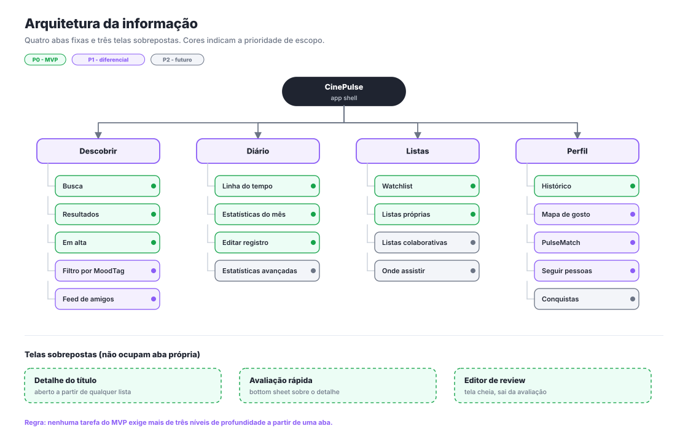

*Arquivo: [`assets/wireframes/ia-sitemap.svg`](assets/wireframes/ia-sitemap.svg)*

**Quatro abas fixas** (Descobrir, Diário, Listas, Perfil) e **três telas sobrepostas** que não ocupam aba própria: detalhe do título, folha de avaliação e editor de review.

**Regras de estrutura**

1. Nenhuma tarefa do MVP exige mais de **três níveis de profundidade** a partir de uma aba.
2. O detalhe do título é acessível de **qualquer** lista — busca, diário, watchlist, feed ou perfil de terceiro. Ele é o hub do produto.
3. A avaliação **nunca** é uma tela nova: é uma folha por cima do contexto. Trocar de tela custaria o contexto do título e permitiria "perder o lugar".
4. Filmes e séries **não** têm abas separadas (princípio de UX nº 4 do doc 02).
5. O botão **+** flutuante está presente em todas as abas: registrar é a ação de primeira classe do produto.

As cores no diagrama indicam a faixa de prioridade do [doc 03](03-mvp-e-requisitos.md): verde = P0 (MVP), roxo = P1 (diferencial), cinza = P2 (futuro). Assim dá para ver, em uma imagem, o que existe no CP5 e o que fica para depois.

---

## 3. Fluxo principal

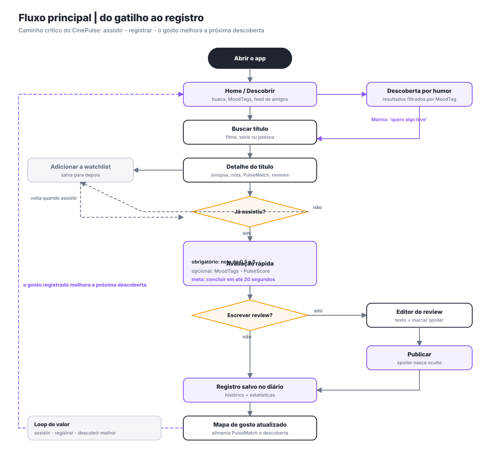

*Arquivo: [`assets/wireframes/wf-00-fluxo-principal.svg`](assets/wireframes/wf-00-fluxo-principal.svg)*

Versão textual, para leitura rápida no GitHub:

```text
                        ABRIR O APP
                             │
                     HOME / DESCOBRIR ◀────────────────────┐
                       │           │                       │
              BUSCAR TÍTULO   DESCOBERTA POR HUMOR         │
                       │           │                       │
                       └─────┬─────┘                       │
                             ▼                             │
                    DETALHE DO TÍTULO                      │
                       │           │                       │
            + WATCHLIST │           │                      │
             (assiste   │      ◇ JÁ ASSISTIU? ◇            │
              depois) ──┘       não │      │ sim           │
                                    │      ▼               │
                                    │  AVALIAÇÃO RÁPIDA    │
                                    │  ├ obrigatório: nota │
                                    │  ├ opcional: MoodTags│
                                    │  └ opcional: PulseScore
                                    │      │               │
                                    │  ◇ ESCREVER REVIEW? ◇
                                    │   não │   │ sim      │
                                    │       │   ▼          │
                                    │       │  EDITOR + SPOILER
                                    │       │   │          │
                                    │       │  PUBLICAR    │
                                    │       │   │          │
                                    │       ▼◀──┘          │
                                    │  REGISTRO NO DIÁRIO  │
                                    │       │              │
                                    │  MAPA DE GOSTO ──────┘
                                    │  ATUALIZADO
                                    └──▶ (volta para a Home)
```

**Três propriedades que o fluxo garante**

- **É um ciclo, não uma linha.** O último passo alimenta o primeiro. Um app de listas termina no arquivo; o CinePulse volta para a descoberta.
- **O caminho crítico tem no máximo 5 passos** do gatilho até o registro salvo.
- **Tudo que é opcional está fora do caminho crítico.** PulseScore, MoodTags e review são desvios, nunca pedágios.

---

## 4. Wireframes das telas

### WF-01 · Onboarding e acesso

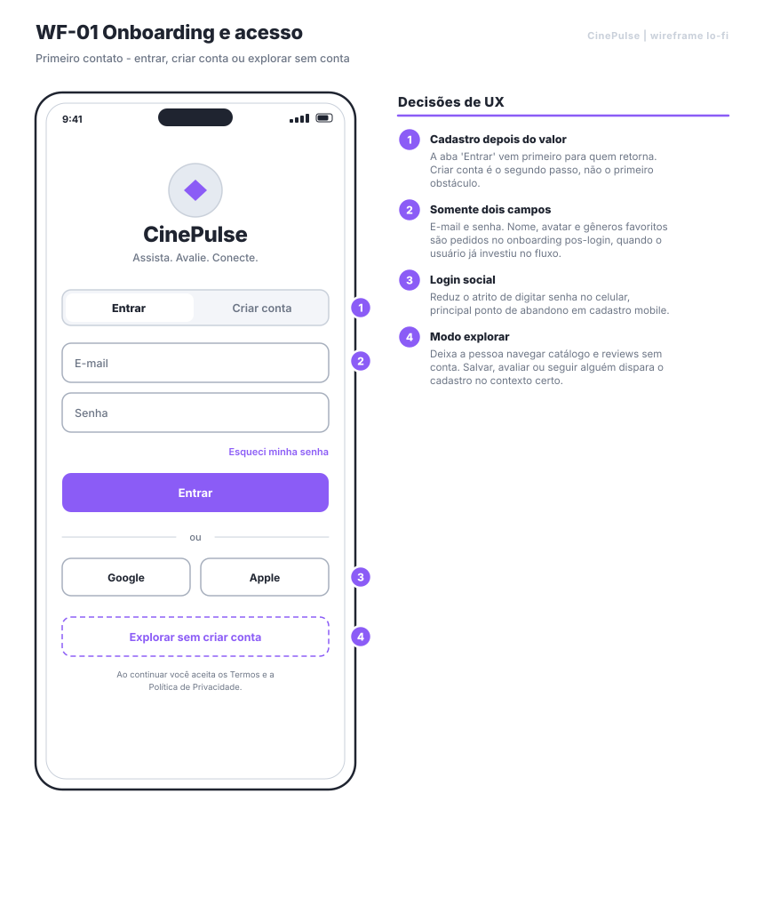

**Decisões**
1. **"Entrar" antes de "Criar conta"** — a maioria dos acessos, ao longo da vida do app, é de quem volta.
2. **Apenas dois campos.** Nome, avatar e gêneros favoritos são pedidos depois do primeiro acesso, quando a pessoa já investiu no fluxo.
3. **Login social** reduz o atrito de digitar senha no celular.
4. **"Explorar sem criar conta"** — o valor aparece antes do cadastro (princípio nº 7). Salvar, avaliar ou seguir alguém dispara o cadastro no contexto certo, e a ação é concluída em seguida.

*Cobre:* US-01, US-02, US-03

---

### WF-02 · Home / Descobrir

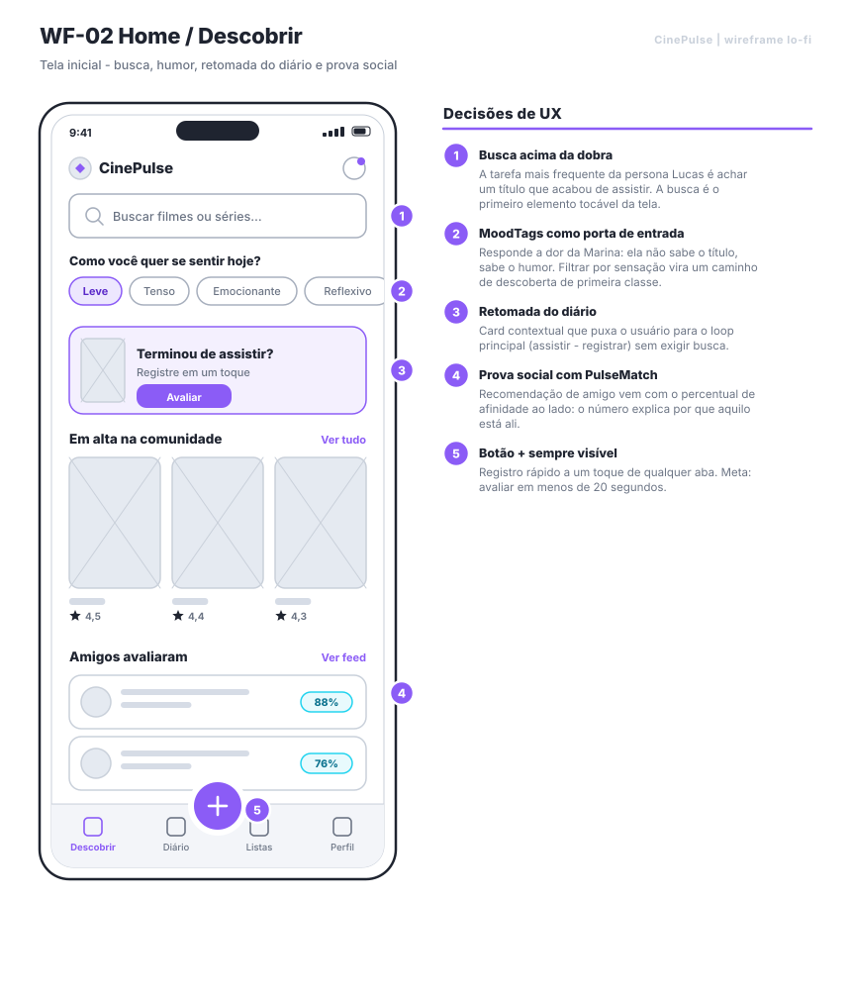

**Decisões**
1. **Busca é o primeiro elemento tocável.** A tarefa mais frequente do Lucas é achar o título que acabou de assistir.
2. **"Como você quer se sentir hoje?"** acima da dobra — responde diretamente à dor da Marina, que não sabe o título, sabe o humor.
3. **Card de retomada do diário** puxa a pessoa para o loop principal sem exigir busca.
4. **Prova social com PulseMatch ao lado.** O percentual explica *por que* aquela recomendação está ali.
5. **Botão + sempre visível**, em todas as abas.

*Cobre:* US-04, US-06, US-07, US-08

---

### WF-03 · Busca e resultados

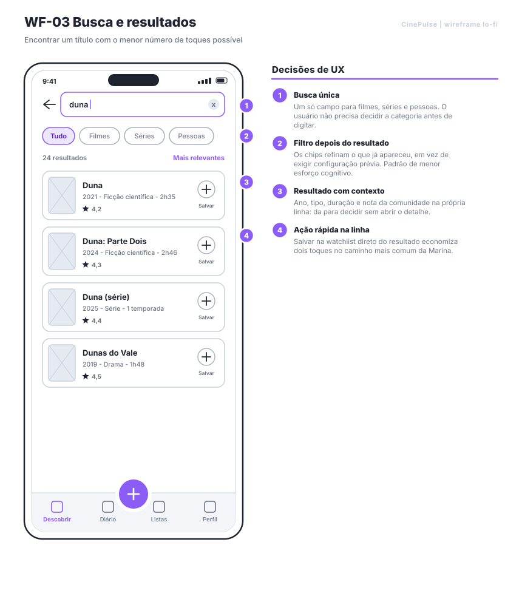

**Decisões**
1. **Busca única** para filmes, séries e pessoas — não se decide a categoria antes de digitar.
2. **Filtro depois do resultado**, não antes. Refinar o que já apareceu custa menos esforço cognitivo do que configurar previamente.
3. **Resultado com contexto suficiente para decidir** (ano, tipo, duração, nota) sem abrir o detalhe.
4. **Salvar direto da linha** economiza dois toques no caminho mais comum da Marina.

*Cobre:* US-04, US-11

---

### WF-04 · Detalhe do título

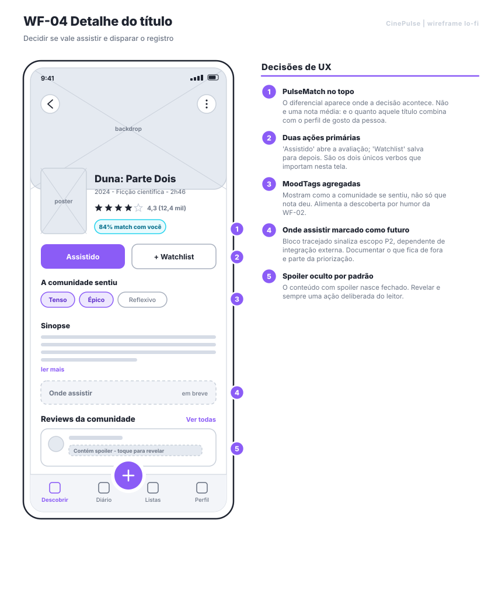

**Decisões**
1. **PulseMatch acima da dobra.** O diferencial aparece onde a decisão acontece — não é nota média, é o quanto aquele título combina com o perfil da pessoa.
2. **Duas ações primárias e só duas:** "Assistido" (abre a avaliação) e "+ Watchlist" (salva para depois).
3. **MoodTags agregadas da comunidade** mostram como as pessoas se sentiram, alimentando a descoberta por humor da WF-02.
4. **"Onde assistir" desenhado tracejado**, sinalizando escopo P2. Mostrar o que fica de fora é parte da priorização.
5. **Spoiler fechado por padrão.** Revelar é sempre ação deliberada do leitor.

*Cobre:* US-05, US-08, US-11, US-13, US-16

---

### WF-05 · Avaliação rápida (bottom sheet)

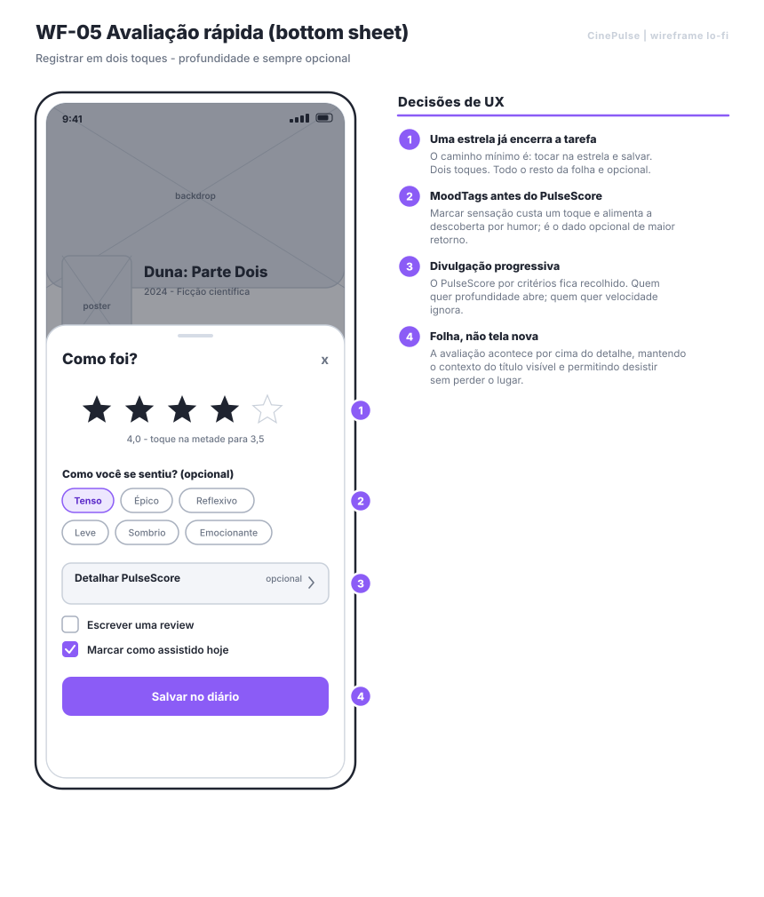

**A tela mais importante do produto.** É onde a promessa dos 20 segundos se cumpre ou não.

**Decisões**
1. **Uma estrela e "Salvar" encerram a tarefa — dois toques.** Todo o resto da folha é opcional.
2. **MoodTags antes do PulseScore.** Marcar sensação custa um toque e alimenta a descoberta; é o dado opcional de maior retorno.
3. **Divulgação progressiva:** o PulseScore por critérios fica recolhido. Quem quer profundidade abre; quem quer velocidade ignora.
4. **Folha, não tela nova.** Mantém o contexto do título visível e permite desistir sem perder o lugar.

*Cobre:* US-08, US-09, US-17

---

### WF-06 · Review com Spoiler Safe

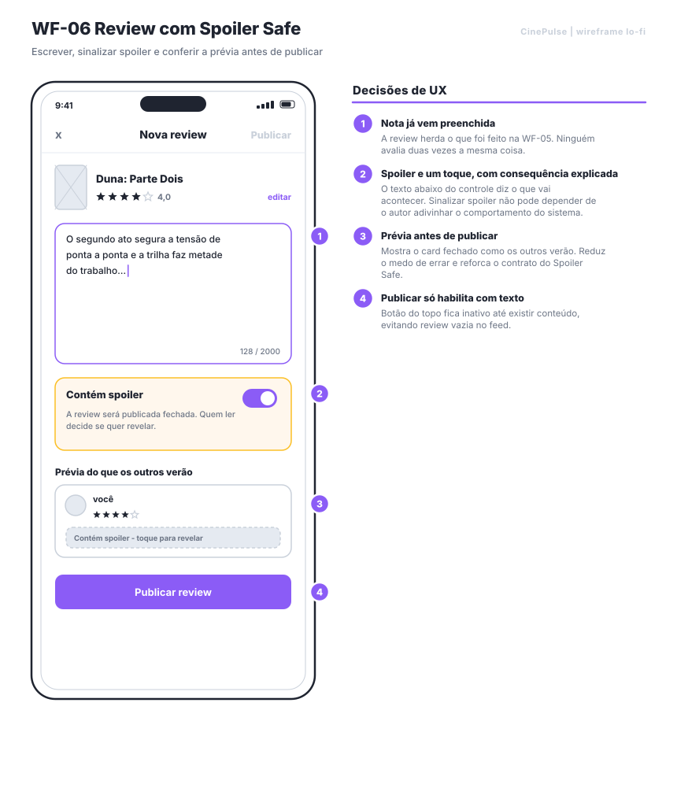

**Decisões**
1. **A nota já vem preenchida** da WF-05. Ninguém avalia duas vezes a mesma coisa.
2. **O controle de spoiler explica a consequência** logo abaixo: "a review será publicada fechada". Sinalizar spoiler não pode depender de o autor adivinhar o comportamento do sistema.
3. **Prévia do card fechado antes de publicar** — reduz o medo de errar e reforça o contrato do Spoiler Safe.
4. **"Publicar" só habilita com texto**, evitando review vazia no feed.

*Cobre:* US-10, US-13

---

### WF-07 · Diário

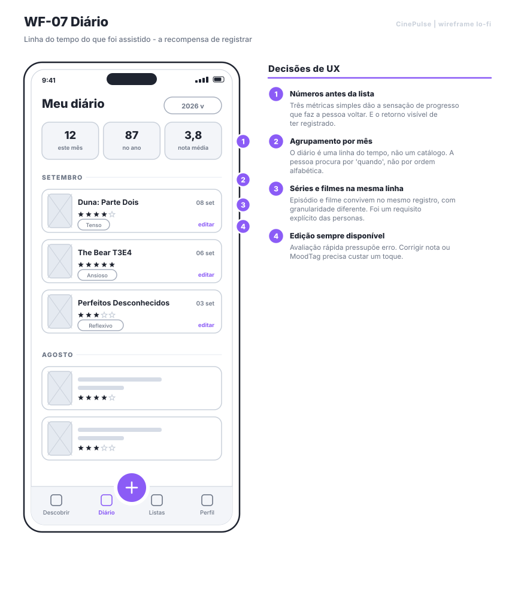

**Decisões**
1. **Números antes da lista.** Três métricas simples dão a sensação de progresso que faz a pessoa voltar — é o retorno visível de ter registrado.
2. **Agrupamento por mês.** O diário é uma linha do tempo; a pessoa procura por "quando", não por ordem alfabética.
3. **Filmes e episódios na mesma linha do tempo**, com granularidade diferente (requisito das personas).
4. **Editar a um toque.** Uma UX de registro rápido pressupõe erro; corrigir precisa ser barato.

*Cobre:* US-12, US-14, US-18

---

### WF-08 · Perfil e PulseMatch

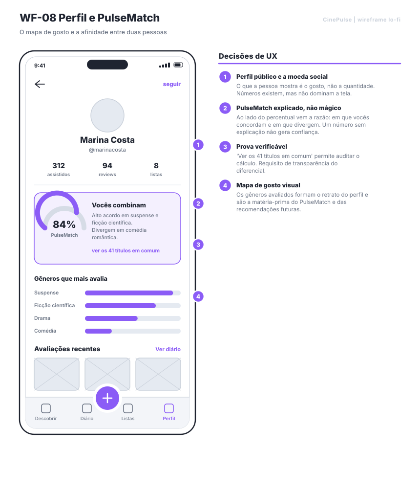

**Decisões**
1. **O que a pessoa mostra é o gosto, não a quantidade.** Números existem, mas não dominam a tela.
2. **PulseMatch explicado, não mágico:** ao lado do percentual vem em que os perfis concordam e em que divergem.
3. **Prova auditável:** "ver os 41 títulos em comum" permite conferir o cálculo — requisito de transparência do doc 03, §6.
4. **Mapa de gosto visual:** os gêneros avaliados formam o retrato do perfil e são a matéria-prima do PulseMatch.

*Cobre:* US-15, US-16, US-18, US-19

---

### WF-09 · Estados: vazio, carregando e erro

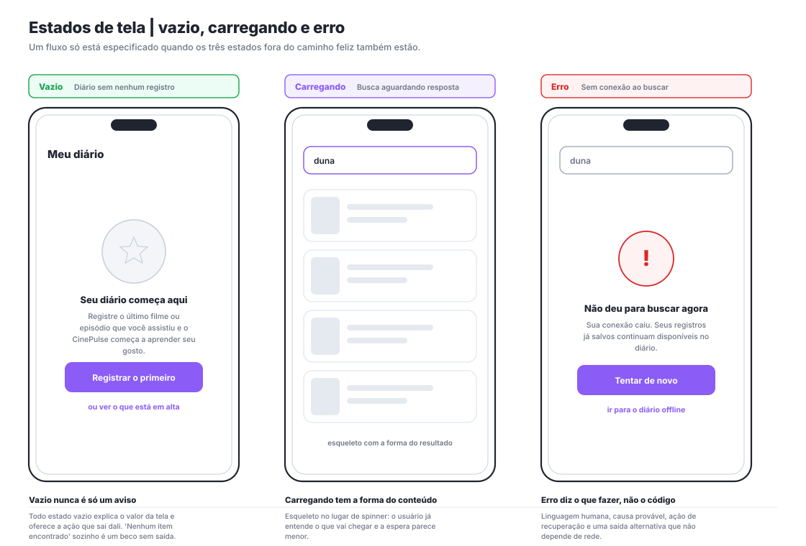

Um fluxo só está especificado quando os três estados fora do caminho feliz também estão. Este é o artefato que costuma faltar em trabalho acadêmico — e o primeiro que quebra no app real.

| Estado | Regra |
|---|---|
| **Vazio** | Explica o valor da tela e oferece a ação que sai dali. "Nenhum item encontrado" sozinho é um beco sem saída |
| **Carregando** | Esqueleto com a forma do conteúdo, não spinner. O usuário já entende o que vai chegar e a espera parece menor |
| **Erro** | Linguagem humana, causa provável, ação de recuperação **e** uma saída alternativa que não depende de rede |

*Requisito não funcional correspondente no doc 03, §8.*

---

## 5. Regras de navegação

1. **A aba não muda sozinha.** Nenhuma ação leva o usuário a outra aba sem que ele peça — exceto salvar um registro, que oferece "ver no diário" como escolha.
2. **Voltar sempre volta.** O botão de voltar do Android nunca fecha o app a partir de uma tela interna.
3. **Folhas fecham por gesto.** Arrastar para baixo cancela; nada é salvo sem toque explícito em "Salvar".
4. **Ação destrutiva pede confirmação** (excluir registro), ação reversível não pede (deixar de seguir).
5. **Toda ação de escrita tem retorno em até 300 ms**, com atualização otimista quando a operação é reversível.

---

## 6. Rastreabilidade wireframe ↔ user story

| Wireframe | User stories cobertas | Fase da jornada |
|---|---|---|
| WF-01 Onboarding | US-01, US-02, US-03 | — |
| WF-02 Home | US-04, US-06, US-07, US-08 | 1 e 2 |
| WF-03 Busca | US-04, US-11 | 2 |
| WF-04 Detalhe | US-05, US-08, US-11, US-13, US-16 | 3 |
| WF-05 Avaliação | US-08, US-09, US-17 | 5 |
| WF-06 Review | US-10, US-13 | 5 |
| WF-07 Diário | US-12, US-14, US-18 | 6 |
| WF-08 Perfil | US-15, US-16, US-18, US-19 | 6 |
| WF-09 Estados | requisito transversal | todas |

Nenhuma user story P0 ficou sem tela, e nenhuma tela existe sem user story que a justifique.

---

## 7. Próximo passo — validar com pessoas

Wireframe aprovado internamente não é wireframe validado. O plano de teste de usabilidade sobre o protótipo `docs/app_interativo.html` está em [10 — Pesquisa e validação](10-pesquisa-e-validacao.md), §5, com as três tarefas cronometradas:

1. Registrar um título que você assistiu recentemente. *(mede a meta dos 20 s)*
2. Encontrar algo leve para assistir hoje à noite. *(valida H5, MoodTags)*
3. Escrever uma opinião sobre o final sem estragar para os outros. *(valida H6, Spoiler Safe)*
